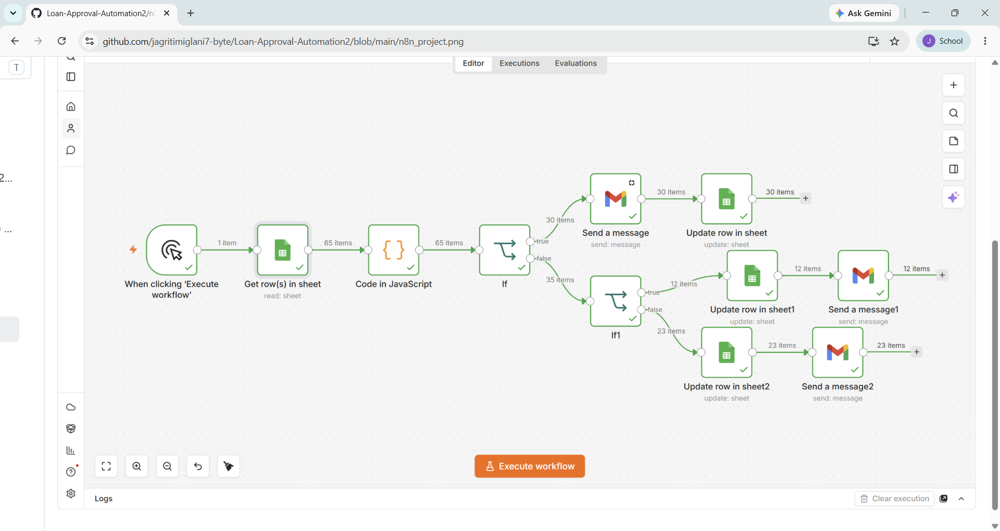
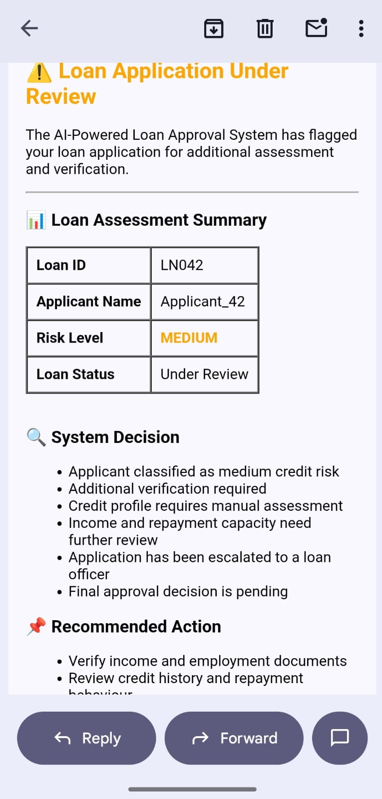

# Loan Approval Automation using n8n

## Project Overview

This project automates the loan approval process using n8n workflow automation. The system evaluates applicant risk levels and automatically sends appropriate email notifications based on the loan assessment.

## Objectives

* Automate loan application processing
* Classify applicants into risk categories
* Send automated email notifications
* Improve decision-making efficiency
* Visualize loan insights through dashboards

## Tools Used

* n8n
* Microsoft Excel
* Gmail Integration
* Power BI

## Workflow Process

1. Loan application data is stored in Excel.
2. n8n reads applicant information.
3. Risk assessment logic categorizes applicants.
4. Automated emails are generated:

   * Low Risk Approval
   * Medium Risk Review
   * High Risk Rejection
5. Results are visualized using Power BI.

## Project Files

### Workflow

### Loan Application Data

### Low Risk Email

### Medium Risk Email

### High Risk Email

# Power BI Dashboard

## Objective

To visualize loan approval data and generate actionable business insights.

---

## Dashboard KPIs

- Total Applications
- Approved Loans
- Rejected Loans
- Approval Rate
- Average Credit Score
- High Risk Applicants

---

## Dashboard Features

### Risk Analysis
- Low Risk Applicants
- Medium Risk Applicants
- High Risk Applicants

### Loan Status Analysis
- Approved
- Rejected
- Review

### Employment Analysis
- Salaried Applicants
- Self-Employed Applicants

### Business Insights
- Approval trends
- Risk distribution
- Loan performance metrics

### Recommendations
- Improve high-risk applicant screening
- Promote low-risk lending
- Monitor credit behavior

---

## Power BI Dashboard Screenshot

---

# Repository Contents

| File | Description |
|--------|-------------|
| Loan_Approval_Automation.json | n8n workflow export |
| Loan_Dataset_Industry_Ready.xlsx | Loan dataset |
| n8n_workflow.png | Workflow architecture |
| google_sheet.png | Google Sheets integration |
| low_risk.jpeg | Low risk email |
| medium_risk_alert.jpeg | Medium risk email |
| high_risk_alert.jpeg | High risk email |
| dashboard.png | Power BI dashboard |

---

# Key Skills Demonstrated

- Workflow Automation
- Power BI Dashboarding
- Financial Analysis
- Business Intelligence
- Google Sheets Automation
- Email Automation
- Risk Assessment
- Data Visualization

---

# Business Impact

- Reduced manual loan processing effort
- Faster approval decisions
- Improved customer communication
- Enhanced financial guidance accessibility
- Better data-driven decision making
- Real-time reporting and monitoring

---

## Business Benefits

* Reduces manual effort
* Improves response time
* Standardizes loan decisions
* Supports risk management
* Enhances reporting and monitoring

## Author

Jagriti Miglani
MBA Finance
